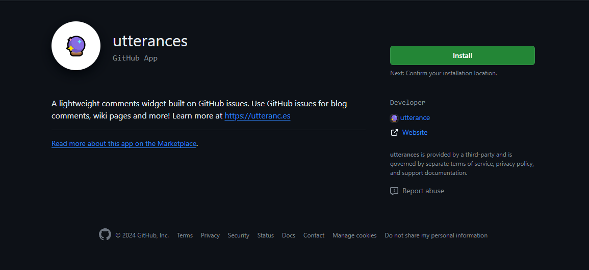
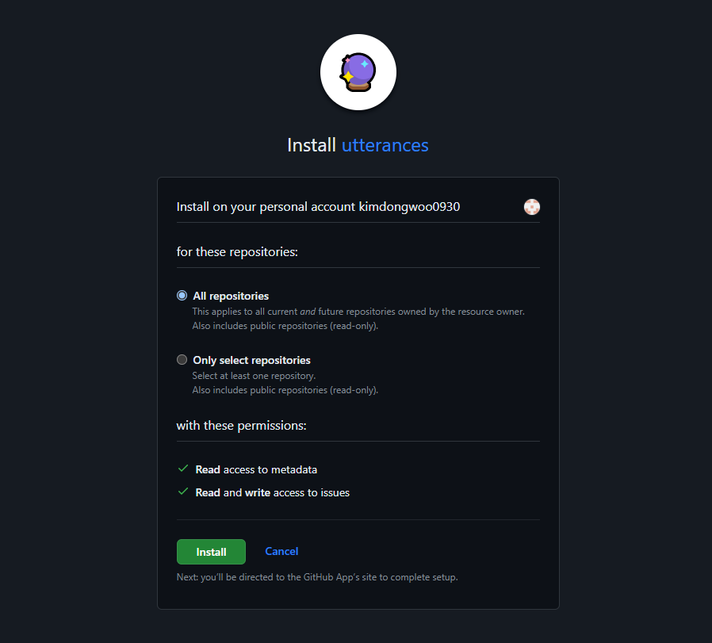

## Jeckyll Chripy 댓글기능

---

- Chripy는 Disqus라는걸 기본으로 지원하고있습니다.

Disqus를 사용해 본적은 없지만, Disqus의 기능들이 유료화가 되었다고 하고 커스터마이징도 어렵다는 글을 봤습니다.

그래서 다른 것을 찾아보다가 **[Utterances](https://utteranc.es/)** 라는걸 알게되었습니다. `Utterances`는 github의 이슈를 댓글로 표시하는 것이고, 무료로 사용이 가능하다고 한다.

<br/>

### Utterances

---

`Utterances`가 로드가 되면 github의 이슈를 검색 가능한 api를 이용하여 url 또는 Pathname에 기반하여 페이지 관련 이슈를 찾아 보여주고 `Utterance-bot`이 누군가 처음 댓글을 달 때 자동으로 이슈를 생성해줍니다.

- 제목과 일치하는 페이지의 이슈를 찾을 수 없는 경우에도 문제가 생기지 않습니다.

<br/>

### 설치하기

---

**[링크](https://github.com/apps/utterances)** 클릭하시면 설치페이지로 이동됩니다.

<p align="center"></p>

<br/>

Install 버튼을 누르면 아래 사진처럼 나옵니다.

- Only select repositories를 선택하지 않으면 모든 레파지토리로 적용이 됩니다.
- Select repositories를 누르면 자신의 레파지토리들이 뜨는데 그중 블로그 레파지토리를 선택해주면됩니다.

<p align="center"></p>

설치가 완료되면 Utterances 홈페이지로 이동됩니다.

<br/>

### Configuration

---

Utterances 홈페이지를 내려보면, 중간에 **Configure** 섹션이 나옵니다.  
그 곳에 자신의 저장소를 입력하는 부분이 있습니다. 입력 형식은 **[저장소ID]/[저장소명]** 으로 입력해야합니다.  
`Ex) kimdongwoo0930/kimdongwoo0930.github.io`

그 후 다른 것들은 건들지 않고 화면을 내리다보면 `Enable Utterances` 섹션이 있습니다.  
여기에 생성되어 있는 자바스크립트 코드를 복사해야합니다.

- 대신 `repo=` 부분에 자기가 입력한 저장소명이 맞는지 확인한 후 복사를 해주세요.

<br/>

### 스크립트 적용하기

---

`_layouts/post.html` 파일끝부분에복사한 스크립트를 그대로 넣어주면 됩니다.

- 전 테마를 dark로 했습니다.

```html
    <!-- post.html 하단에 추가해주어야한다. -->

        </div>
        <!-- .post-tail-bottom -->
    </div>
    <!-- div.post-tail-wrapper -->

    <!-- Utterances 댓글 스크립트 추가 -->
    <script src="https://utteranc.es/client.js"
            repo="kimdongwoo0930/kimdongwoo0930.github.io"
            issue-term="pathname"
            theme="github-light"
            crossorigin="anonymous"
            async>
    </script>

```

<br/>

### 결과

---

모두 다 설정한 후 게시글 맨밑부분을 보면 아래 사진과 같은 댓글창이 생기면 성공입니다.


<br/>

여기에 로그인을 한 후 댓글을 추가하면 블로그 레파지토리에 이슈부분에 추가가 됩니다.

### 끝~ 
같았지만 
