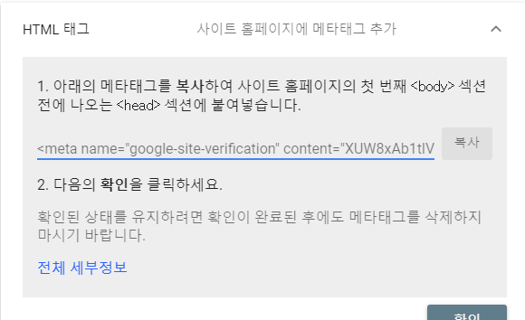
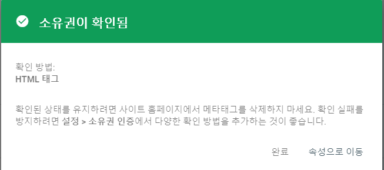
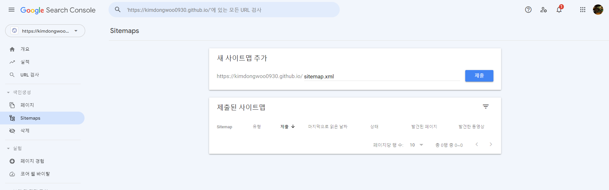

## 검색엔진 노출
---

나는 처음에 아무것도 안해도 검색하면 자동으로 노출이 되는줄 알고 있었다.  
하지만 여러 설정들을 해줘야한다는 것을 알고 설정하는 법을 정리 했다.  

<br/>

### 준비
---
우선 등록을 하기위해서는 검색 엔진 사이트의 계정이 필요합니다.  
저는 구글에 등록을 하기위해서 계정을 준비했습니다.

<br/>

### 구글 웹마스터 도구 등록
---
먼저 구글 [웹마스터 도구](https://search.google.com/search-console/welcome?hl=ko&utm_source=wmx&utm_medium=deprecation-pane&utm_content=home)에 접속해야합니다.  
사이트에 접속한 후 구글 계정을 로그인을 해야합니다. -> 로그인을 하면 아래와 같은 화면이 있을겁니다.


* URL 접두어 부분에 깃블로그 사이트 주소를 입력하고 계속버튼을 누르면됩니다.

<br/>

#### 소유권 확인

소유권 확인하기 창이 뜨면 **다른 확인 방법** 에서 **HTML태그** 항목을 선택해야합니다. jekyll에서 header부분을 세팅할 수 있게 되어있기 때문에 이 방법이 더 좋습니다.



- 메타 태그를 복사를 한 후 확인버튼은 누르지 마세요.

복사가 됐으면 창은 그대로 두고 코드를 확인합니다.

```html
    <meta name="google-site-verification" content="XUW8xA....................Kppo" />
```

<br/>

#### `_config.yml`에 등록
---
**_config.yml** 파일에 보면 **google_site_verification** 항목에 위에서 복사한 메타 태그에서 content부분을 넣어주면 됩니다.

* _config.yml 파일을 먼저 git push를 합니다.

> **git push를 했으면 deploy가 끝날 때까지 잠시 기다려주세요.**

<br/>

#### 소유권 확인하기
---
메타 태그를 복사했던 브라우저 창으로 확인을 누르면 구글에서 인증을 한 후 성공했다면 소유권이 확인됨이라고 뜰 것이다.



이후 sitemap을 등록해줘야합니다.

<br/>

#### sitemap.xml 등록

블로그 폴더안을 보면 sitemap.xml이라는 파일이 있을겁니다. 대부분 자동으로 생성됩니다.

- 저기 반칸에 sitemap.xml을 입력해주고 제출을 눌르고 성공이 뜨면 등록이 완료된 것입니다.  

<br/>

#### 마무리
모든걸 다 설정해도 구글 검색에 바로 노출이 되지는 않고 몇일에서 몇주까지 걸릴 수 있다고 합니다. 

